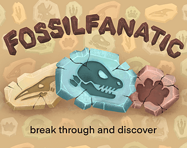
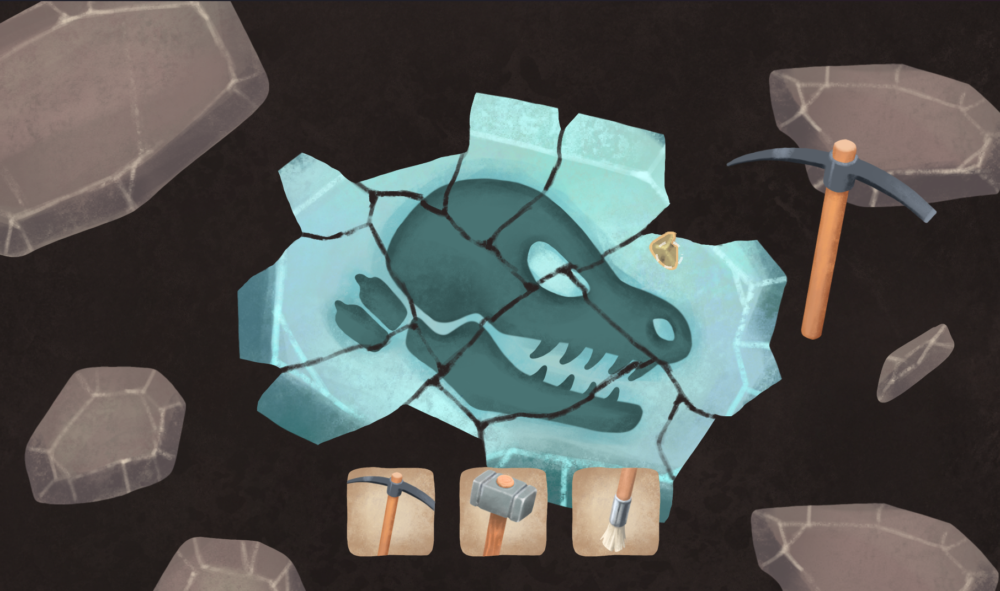
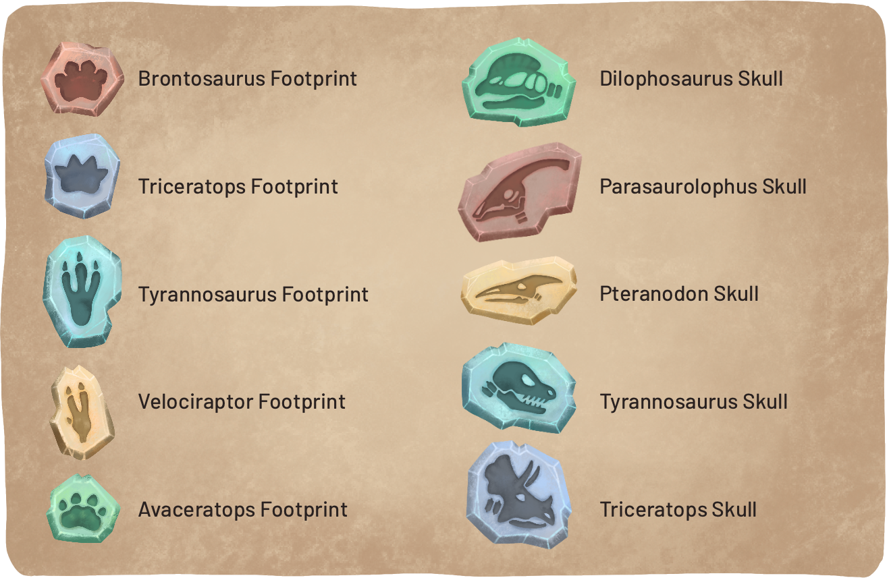

# Fossil Fanatic

This game was created for [PULS Game Jam 2025](https://itch.io/jam/puls-game-jam) in the [Godot Game Engine](https://godotengine.org/)

You can play the game on [itch.io](https://sirlich.itch.io/fossil-fanatic).

## Contributors

1. Programming/Design: [SirLich](https://sirlich.dev/)
2. Art: [Neon Flores](https://www.neonflores.com/), Tanja
3. Music/SFX: [philsharmony](https://github.com/PhilsHarmony)
4. Programming: Marcus

# Release Notes

## 1.1.0
 - General reorganization and cleanup from the jam version
 - Fixed background incorrect at different screen resolutions.
 - Tools now operate on-click, not on-release
 - 

## 1.0.3

The version that we submitted to PULS Game Jam.
